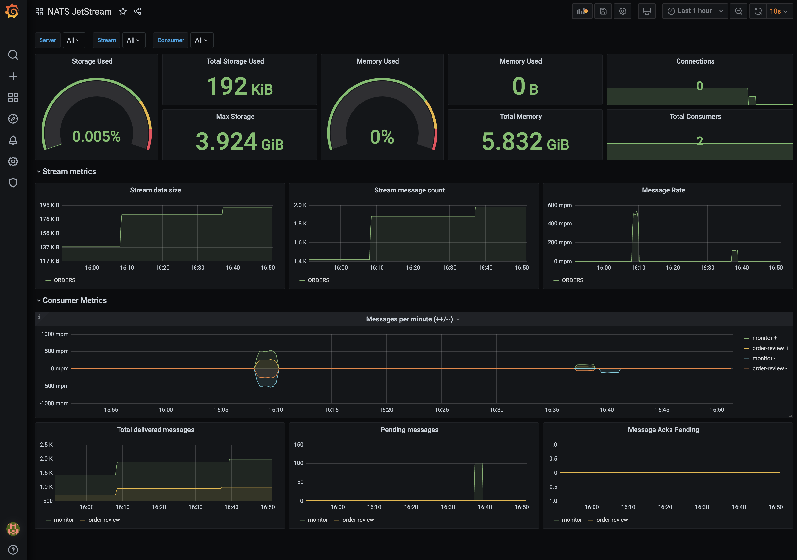

# NATS JetStream Example Environment

A simple docker-compose environment to bring up a NATS JetStream environment to play with.

_Some golang JetStream example code copied from: https://github.com/shijuvar/go-distsys_

## Bring up Environment
```sh
docker compose up -d
```

This will bring up:
* NATS server
* NATS promehteus exporter (http://localhost:7777/metrics)
* Prometheus (http://localhost:9090/)
* Grafana (http://localhost:3000/)

The prometheus targets and grafana datasource and dashboards should be automatically provisioned.

The NATS JetStream dashboard should look something like this:  


## Publish messages and subscribe to streams
Run the go publisher:
```sh
cd create-order
go run main.go
```

Run the order-review subscriber (subscribes to `ORDERS.created` and publishes `ORDERS.approved` messages)
```sh
cd monitor
go run main.go
```

Run the monitor subscriber (simply subscribes to all subjects in the `ORDERS` stream)
```sh
cd monitor
go run main.go
```


## Open up the NATS CLI
Open up the NATS cli:  
```sh
docker run -ti --network go-nats_nats natsio/nats-box
```

**Some useful commands:**
```sh
nats -s nats account info
nats -s nats stream ls
nats -s nats stream ORDERS
nats -s nats stream view ORDERS
nats -s nats stream info ORDERS
nats -s nats stream view ORDERS 2
nats -s nats consumer info ORDERS monitor
nats -s nats consumer info ORDERS order-review
```
